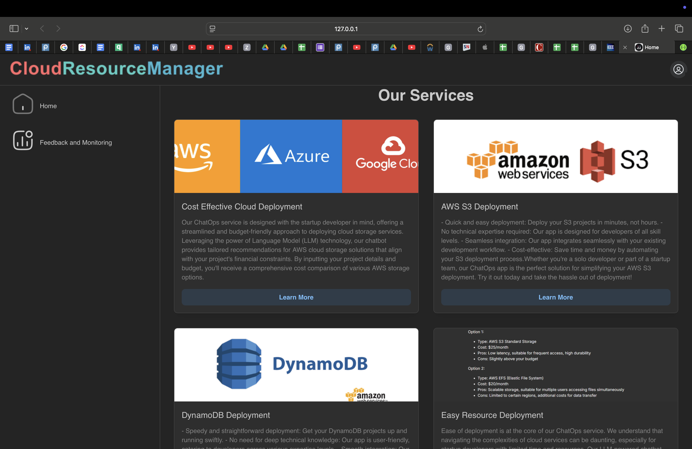

# Capstone Project MSEAI 2024: Cloud Resource Management
## Assistant for Effortless Cloud Resource Management and Experimentation
### Team: Carmel Prosper SAGB0 & Birhanu Shimellis & Ellon & Alexis NGOGA 

## Link to the original Report Paper
[Report Paper](./capstone-final-report.pdf)
## Link to the Video
[Video Presentation](https://youtu.be/0_Sx49l4VHQ)

> ### Topic: 
> Cloud resource management is important and cost critical for startup.

> ### Core Message: 
> An efficient interaction for architecture building in the cloud is important to keep Business in Startup.

### Architecture
> Here is the high level architecture of the project

> 
> ### Objective: 
> Running on premise architecture for startup incur a lot of money and human resources to keep Business up on the Market. For a startup working with team of developer without a whole cloud infrastructure and computing skills the current project aims to create easier tool to generate architect with efficient throughput for resource needed based on budget (Chat + Price Calculation)  and guidance on how to run experiment
> In this project the end tools provide ability provision cloud data storage (eg. S3, DynamoDB) and manipulate their lifecycle based personal AWS secret key. 
> The user start by prompting his need through some project details then can continue the discussion with the agent based on recommendation and end-to-end guided discussion.
> If satisfied at any point the user can generate or terminate a cloud storage with custom details.


### Sequence Diagram
> Here is an example of the sequence diagram of on scenario of the project


To successfully run the project, you need to follow the following steps:
> * First clone the project from the repository
> * Second install the required dependencies using __pip__ or __conda__
> * Make sure that the version of Python is 3.12 or higher
> * Create a virtual environment and activate it
> * Then install the required dependencies using the following command in the root directory of the project or the location where the requirements.txt file is located

```
pip install -r requirements.txt
```

After a successful installation of the dependencies, you can run the project by following the steps below:

> You have to open three different terminals and activate the virtual environment in each terminal

#### To run the dash app you have to be in the dash folder in your terminal
```
export SECRET_KEY=<secret-dash>
```
```
dash$ python3 app.py 
```
> ### Dash UI: The Dash UI is available at http://localhost:8050


#### To run the chatagent you have to be in the copilot folder
```
copilot$ chainlit run chainlit_copilot.py 
```
#### To run the backend you have to be in the copilot folder in your terminal

```
copilot$ python3 s3_API_call_v3.py 
```
> ### API Documentation: The api documentation is available at http://localhost:5000/apidocs


### Performance Evaluation:


### Key Challenges:
- Limited data storage for Vector store

- LLM hallucination

- Personal access key use for resource provisioning
